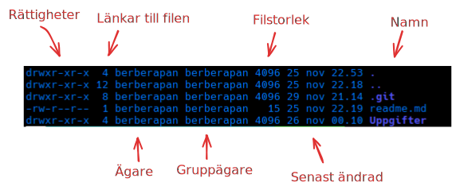

## Alla dessa flaggor...

Gå nu till **Uppgifter/2**.

<details>
<summary>Tips</summary>
```bash
cd ../2
```
</details>

---

Innan vi går vidare, här är några användbara tricks för terminalen:

- **Ctrl + l** eller **clear**: Rensar terminalfönstret
- **history**: Visar tidigare använda kommandon
- ⬆️ (**uppåt-pilen**): Bläddrar genom tidigare kommandon

---

Nu ska vi gå igenom ett viktigt kommando. Tills nu har vi rört oss genom katalogerna utan att egentligen veta vad som finns i dem.
För att hjälpa oss med det och annat nyttigt så har vi kommandot **ls** (list).

Om du anger endast **ls** så kommer filer och kataloger i katalogen du befinner dig i att visas. Vilket är nyttigt, men många gånger vill man ha lite mer information.
Därför måste vi börja använda oss av flaggor. Du har säkert använt flaggor när du hanterat ett projekt i git eller när du använt dig av curl.

Flaggor börjar med antingen **-** eller dubbla **--** följt av en bokstav eller ord. Exempelvis så kan du oftast få lite hjälp med att förstå hur ett kommando fungerar
genom att skriva `--help`, vilket oftast är flaggan för de kortfattade instruktionerna.

Testa gärna hjälp-flaggan tillsammans med **ls** för att se outputen. `ls --help`

---

**ls** har många användbara flaggor, men två av de mest använda är:

**-l** (long listing format)  
Denna flagga ger en detaljerad lista med information om varje fil:

- Rättigheter (vem som får läsa/skriva/köra filen)
- Antal länkar till filen
- Ägare
- Gruppägare
- Filstorlek
- Senast ändrad (datum och tid)
- Filnamn

Rättigheterna kommer vi gå igenom närmre lite senare. 



**-a** (all)  
Som standard visar inte **ls** dolda filer (filer som börjar med en punkt). Med `-a` flaggan visas alla filer, inklusive:

- Dolda filer (de som börjar med .)
- Katalogen du står i (.)
- Föräldrakatalogen (..)

Du kan också kombinera flaggor till en flagga. Till exempel visar `ls -la` eller `ls -al` en detaljerad lista över alla filer, inklusive dolda filer.

Ett tips är att lägga till `-h` (human readable) när du använder `-l` för att visa filstorlekar i ett mer läsbart format (KB, MB, GB istället för byte).

#### Uppgift
Precis som i förra delen så skriv `bash test.sh` för att starta uppgiften.

Du kan använda **ls** kommandot i skriptet. Ange **"svara"** när du vill svara på en fråga
