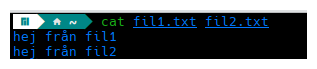

## The cat's pajamas

Näst på tur så har vi **cat**-kommandot. Vi rör oss vidare till **Uppgifter/3** i terminalen.

**cat** (concatenate) är ett av de äldsta kommandona som finns i Linux och det fungerar även på första versionen av Unix från 1973.
Kommandot kan användas för att se vad en fil innehåller utan att behöva öppna ett separat program. 
Använd `cat filnamn` och filens innehåll visas direkt i terminalen. Du kan även sammanfoga flera filer samtidigt. Exempelvis `cat fil1 fil2 fil3`
skulle visa alla de tre filernas innehåll en efter en.



---

Superbra att kunna se innehållet av filer utan att behöva öppna några andra program men det måste väl vara något mer man kan göra? 
Det kan vara bra att ha koll på [Unix-filosofin](https://sv.wikipedia.org/wiki/Unix-filosofin) när vi pratar om kommandon, specifikt de två första punkterna.  

Sammanfattning av filosofin på Wikipedia från McIlroy.
> *Skriv program som gör en sak och gör det bra. Skriv program som arbetar tillsammans.
> Skriv program för att hantera textflöden eftersom det är ett universellt gränssnitt.*

**cat** gör sin sak väldigt bra, och eftersom den följer Unix-filosofin så interagerar den väldigt bra med andra kommandon och system.
För att demonstrera det så kan vi använda något som kallas 'redirects' i terminalen, bland annat **>**, **>>** och **<**. Nedan använder vi de två första tillsammans med **cat**, **<** är något som inte riktigt behövs med kommandona vi har lärt oss hittills men är bra att förstå.

#### Output redirection overwrite (>)

**>** används för att skriva output till en fil. Om filen redan existerar så skriver man över den (så håll tungan rätt i mun och kontrollera att du skrivit rätt filnamn). I exemplet nedan så skrivs det som finns i fil1 och fil2 in tillsammans i en ny tredje fil.

```bash
cat fil1.txt fil2.txt > fil3.txt
```

Det är inte bara **cat** som du kan använda det här för. Allt som har en output kan användas, exempelvis **echo** som vi tagit upp tidigare kan du använda för att skapa en ny fil med det som den printar.
```bash
echo $PATH > minpath.txt
```

---

#### Output redirection append (>>)

**>>** fungerar som overwrite men lägger istället till output till filen. Exemplet nedan gör att innehållet från fil2 läggs till fil1 istället för att skapa en ny fil.

```bash
cat fil2.txt >> fil1.txt
```

---

#### Input redirection

**<** matar in innehållet från en fil till ett kommando. Som jag nämnde ovan är det lite överflödigt för det vi jobbat med hittills så jag passar på att introducera två nya kommandon här.

Vi kan testa detta med kommandot **wc** (word count) som räknar rader, ord och tecken i en fil. Med flaggan -l räknar vi rader.
```bash
wc -l < fil1.txt
```
När vi använder `wc -l < fil1.txt` så läser vi innehållet i filen och skickar det direkt till **wc**-kommandot. Det här kan jämföras med `wc -l fil1.txt` som ger samma resultat.
Vad är då skillnaden? Varför ens använda input redirection?

- Med `wc -l fil1.txt` så säger vi åt **wc** "här är en fil, läs den"
- Med `wc -l < fil1.txt` så säger vi istället "här är innehållet från en fil"

I de flesta fall får du samma resultat, men vissa kommandon är byggda för att ta emot innehåll direkt och inte filnamn. Det här är ett enkelt exempel på hur olika Unix-kommandon kan samarbeta på olika sätt, antingen genom att skicka filer eller innehåll mellan varandra.

Innan vi hoppar på uppgifterna så ska jag snabbt nämna kommandot **sort**. Den sorterar text alfabetiskt men kan även sortera på annat, men det får du undersöka själv i --help.

Säg att vi har en fil med olika emailadresser som du vill sortera i alfabetiskt ordning i en ny fil då kan du skriva som i exemplet nedan.
```bash
sort < emails.txt > sorterade_emails.txt
```

Precis som tidigare exempel så går det bra att skriva utan input redirection här då sort kan hantera filnamn utan problem.

---

#### Uppgift
Starta genom att skriva `bash test.sh` som vanligt.

