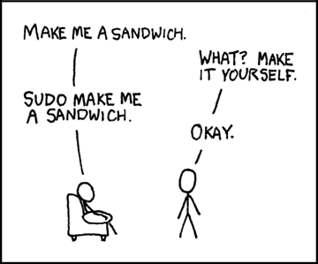

## I Ragnar Östberg anda

**Uppgiter/4** står på tur. 

I den här delen ska vi ta en titt på kommandon för att skapa, flytta och ta bort filer.

---

#### Skapa

Som vi såg i den förra delen så kan man skapa en fil genom redirection. Många saker går att göra på olika sätt, tack vare hur saker är byggda enligt Unix-filosofin.

Det vanligaste sättet för att skapa en tom fil är dock att använda kommandot **touch**. Du behöver bara ange vilket filnamn du vill ha.
Du behöver dessutom inte vara rädd för att skriva över något av filens innehåll om du anger ett filnamn som redan existerar. Det enda som händer i det fallet är att "senast ändrad"-tiden uppdateras till tiden du skrev kommandot.

```bash
touch filnamn.java
```
För att skapa en ny katalog (som sagt tidigare, kan lika gärna säga mapp), så använder vi kommandot **mkdir** (make directory). Du kan skapa flera undermappar samtidigt med -p flaggan.
```bash
# Skapa en ny katalog
mkdir min_javakod

# Skapa flera mappar i en förälderkatalog. Den skapas också om den inte redan existerar.
mkdir -p min_javakod/{src,test}
```
 ---

#### Flytta/Ändra  

För att flytta filer och kataloger använder vi kommandot **mv** (move). 
Detta kommando används också för att byta namn på filer och kataloger. Kommandot är väldigt enkelt, först anger du källan och sedan destinationen.
```bash
# Flytta en fil till en katalog
mv filnamn.java min_javakod/

# Byta namn på en fil
mv filnamn.java minjavafil.java

# Flytta och byta namn samtidigt
mv filnamn.java min_javakod/minjavafil.java
```
För att kopiera filer använder vi kommandot **cp** (copy). Det fungerar på liknande sätt som **mv**.
```bash
# Kopiera en fil
cp filnamn.java minjavafil_kopia.java

# Kopiera en fil till en annan katalog
cp filnamn.java min_javakod/

# Kopiera en hel katalog och dess innehåll (använd -r flaggan)
cp -r min_javakod min_javakod_backup
```

---

#### Ta bort

För att ta bort filer och kataloger används kommandot **rm** (remove). 
Var försiktig med detta kommando eftersom filerna försvinner. 
De flesta operativsystem har skydd för det nu men det var lätt att ta bort allt innehåll från en dator med ett enkel `rm -rf /` kommando förr (/ destinationen är roten för operativsystemet).
```bash
# Ta bort en fil
rm filnamn.java

# Ta bort en katalog och allt dess innehåll (recursive)
rm -r min_javakod

# Tvinga borttagning utan varningar (-f för force)
rm -f känsligfil.java

# Kombinera flaggor för att ta bort en katalog utan varningar
rm -rf känslig_katalog
```

---

#### Sudo

När man ska ändra i filer utanför hemkatalogen eller behöver utföra något annat systemkritiskt så kommer kommandot kräva att visa du har admin-rättigheter.
Om du har det så kan du då använda **sudo** (superuser do). 

Ibland känns det som att lägga till **sudo** löser det mesta.



Men var försiktig med hur du använder **sudo**. När du använder **sudo** för att installera något, exempelvis en nodejs modul, så ger du modulen adminbehörigheter (den har alltså full tillgång til ditt system).
Så om du inte är säker på källan använd inte **sudo**, och fundera alltid på varför något kräver **sudo** innan du ger den några behörigheter.

```bash
# Installera ett program (exempel från Ubuntu/Debian)
sudo apt install programnamn

# Redigera en systemfil
sudo nano /etc/hosts

# Ta bort en skyddad fil
sudo rm /var/log/systemfil.log

# Skapa en katalog i systemet
sudo mkdir /opt/mittprogram
```

--- 

#### Uppgift 
